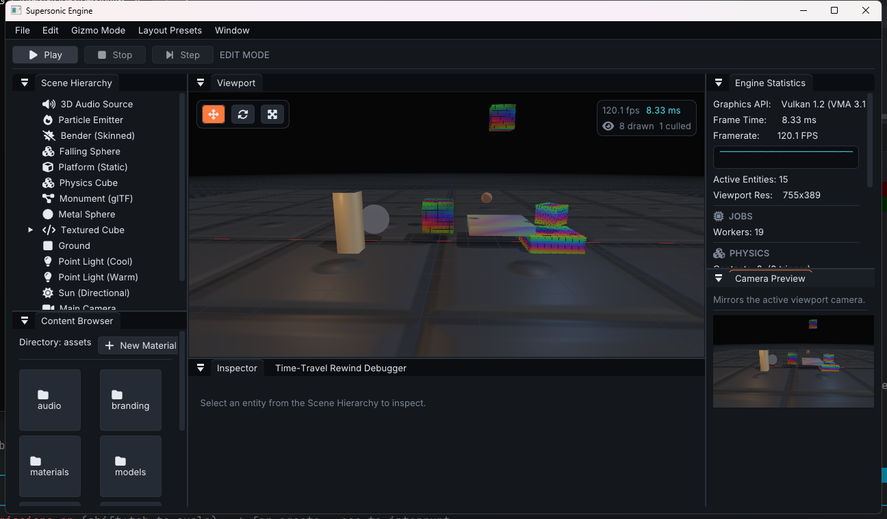
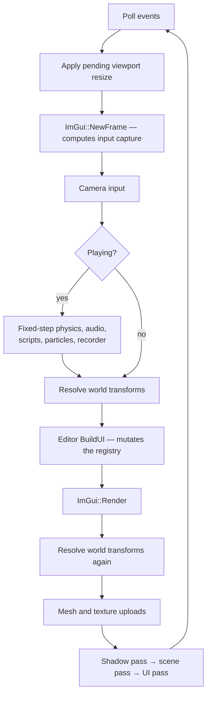

<div align="center">


**A Vulkan 1.2 game engine and editor, written from scratch in C++20.**

Data-oriented ECS core · physically based renderer · dockable editor · hot-reloadable C++ gameplay

[](#requirements)
[](#renderer)
[](#build)
[](#testing)
[](#code-standards)
[](LICENSE)

</div>

---

## What this is

Supersonic is a complete engine, not a renderer with a UI bolted on. Game state
lives in flat [EnTT](https://github.com/skypjack/entt) components; logic lives in
stateless systems over those components; every byte of GPU memory is allocated
through VMA. The editor is part of the engine rather than a separate application:
it edits the same registry the renderer draws and the physics steps.

It is a solo project, built to be read as much as to be run. Where the
implementation departs from the design, the departure is written down in
[ARCHITECTURE.md](ARCHITECTURE.md) instead of being left as an aspiration the
code quietly contradicts.

<div align="center">

<br>
<sub>The editor running the sample scene — shadow-mapped PBR, normal-mapped surfaces, skeletal animation, glTF and procedural geometry, live frame statistics.</sub>
</div>

---

## Features

### Renderer

| | |
|---|---|
| **Physically based shading** | Cook–Torrance GGX with metallic / roughness / ambient-occlusion inputs, per-material |
| **Lighting** | Up to 8 simultaneous lights — directional, point and spot — with distance attenuation and a smooth cone falloff |
| **Cascaded shadows** | Four 2048² D32 cascades in one array image, fitted to the camera by bounding sphere and snapped to the texel grid so edges do not crawl; per-cascade normal offset, 3×3 PCF, and a cross-fade across each split |
| **Normal mapping** | Tangent-space, with glTF-convention `vec4` tangents (handedness in `w`) generated for procedural meshes too |
| **Frustum culling** | Gribb–Hartmann plane extraction; the scene pass culls against the camera, the shadow pass against the light, so nothing off-screen pops its shadow in and out |
| **HDR + bloom** | Floating-point scene target, luminance-thresholded bright pass with a soft knee, separable half-res blur, then tone map and sRGB encode — exactly one encode, at the end of the chain |
| **Anti-aliasing** | 4× MSAA, resolved into the image the editor samples |
| **Pipeline cache** | The driver's compiled pipelines persist to disk between runs, validated against vendor, device and driver UUID before reuse |
| **Grid** | Procedural infinite ground grid, depth-tested and analytically anti-aliased |

### Assets

- **glTF 2.0** import via tinygltf — meshes, materials, texture references, **skins and animations**
- **Wavefront OBJ** import
- **Textures** through `stb_image`, with per-material descriptor sets cached by texture pair
- **Procedural geometry** — cube, sphere, plane, and a heightfield **terrain generator**
- **Shared materials** as `.material` assets — one asset, many entities, edited once; create and assign them from the content browser, or detach an entity with *Make Unique*
- **Scenes and prefabs** as readable JSON (`.scene`, `.prefab`), parsed by a hand-written reader with no external dependency

### Simulation

- **Input** — named actions and axes over keyboard, mouse and gamepad; any bound source satisfies an action, so a pad and a keyboard drive the same game without either knowing about the other
- **Fixed-step physics** with an accumulator capped so a hitch costs fidelity rather than exploding the solver
- **World queries** — raycast, sphere overlap and a ground check against *colliders* rather than render bounds, available to C++ and to hot-reloaded scripts
- **Collision** — sort-and-sweep broadphase, exact sphere–sphere and sphere–box narrowphase, box–box by world AABB along the axis of least overlap; mass-weighted impulse response with Coulomb friction, slop-limited positional correction so stacks settle instead of vibrating, immovable collider-only obstacles, and non-resolving trigger volumes
- **3D audio** on XAudio2 with a from-scratch WAV decoder, inverse-distance attenuation and listener-relative panning
- **Particle systems** with per-emitter pools, so two emitters cannot starve each other
- **Job system** — a worker pool with a counter fence, used where the work is genuinely independent: terrain generation, per-vertex tangent bases and particle integration. Command recording, the transform hierarchy, scripts and collision response stay on the main thread on purpose, and the code says why
- **Skeletal animation** — glTF skins and animation channels with LINEAR, STEP and CUBICSPLINE interpolation; joints are reordered parent-before-child at load so a pose is one forward pass, the joint palette lives in a storage buffer indexed per draw, the shadow pass skins from the same palette, and the render bounds follow the pose so an animated character is not culled against its bind box
- **Scripting** — built-in components plus a **hot-reloadable C++ plugin**: rebuild the script target while the engine runs and the new code is swapped in without a restart

### Editor

| | |
|---|---|
| **Dockable layout** | ImGui docking with saved layout presets |
| **Hierarchy** | Full transform parenting via drag-and-drop, with cached world matrices |
| **Inspector** | Every component editable, with a dynamic *Add Component* menu |
| **Gizmos** | ImGuizmo translate / rotate / scale, `W` `E` `R` |
| **Selection** | Viewport raycast picking against real mesh bounds, not an assumed unit cube |
| **Play / Pause / Stop / Step** | Snapshots the scene on Play and restores it on Stop, so a scene can be authored, tried, and got back |
| **Undo / redo** | 64 steps over the scene serializer — `Ctrl+Z`, `Ctrl+Y` |
| **Animator** | Clip, speed, loop and a scrubbable time slider — poses evaluate every frame, so scrubbing shows the result immediately |
| **Time-travel rewind** | Scrub backwards through recorded simulation frames |
| **Fly camera** | The viewport has its own camera, so framing a shot in the editor does not move the game's |
| **Statistics** | Per-frame CPU zone timings, a frame-time graph plotted from the raw delta so a hitch is actually visible, entity count, draw/cull counts per pass, contact count, worker threads, script-host state |
| **Console** | Levelled, categorised engine log with substring filtering, mirrored to a file beside the binary |
| **Interface** | Inter and Font Awesome embedded in the binary, an accent palette from the engine's own branding, image thumbnails in the browser, a floating viewport HUD, and DPI scaling from the monitor |
| **Packaging** | One-click standalone build of the current scene |

### Platforms

Developed and tested on **Windows** with MSVC. The build system carries target
configurations for **Linux**, **macOS** and **iOS** (MoltenVK) and **Android**
(NDK / NativeActivity); those targets configure and compile but are not yet
soak-tested, and are honestly labelled as such rather than claimed as shipping
support.

---

## Getting started

### Requirements

| | |
|---|---|
| **Compiler** | C++20 — MSVC 2022, GCC 11+, or Clang 13+ |
| **CMake** | 3.20 or newer |
| **GPU** | Any Vulkan 1.2 capable driver |
| **Vulkan SDK** | Strongly recommended — see below |

Every third-party dependency is vendored under `third_party/`. There is no
package manager step and nothing to fetch: GLFW, GLM, EnTT, ImGui, ImGuizmo,
stb, tinygltf, VMA and the Vulkan headers are all in the tree.

> **On Linux, that is not quite the whole story.** GLFW needs X11 development
> headers to configure at all, and GLFW 3.4 defaults to building a Wayland
> backend and hard-fails with `Failed to find wayland-scanner` unless the full
> Wayland toolchain is present. ALSA's headers are what decide whether the
> engine gets real audio or compiles its documented no-op. What CI installs:
>
> ```bash
> sudo apt-get install -y libvulkan-dev libx11-dev libxrandr-dev >   libxinerama-dev libxcursor-dev libxi-dev libxkbcommon-dev >   pkg-config libasound2-dev
> cmake -S . -B build -DGLFW_BUILD_WAYLAND=OFF
> ```

> **On the SDK.** The engine builds and runs without it, falling back to the
> vendored headers and the loader that ships with your driver. But without
> `VK_LAYER_KHRONOS_validation`, invalid Vulkan usage does not produce an error
> message — it produces an access violation, or nothing at all until the code
> runs on someone else's hardware. The SDK also supplies `glslc`; without it
> CMake cannot rebuild the shaders and falls back to the committed SPIR-V, so
> GLSL edits are silently ignored. CMake warns when that happens.

### Build

```bash
# Single-config generators (Ninja, Makefiles) — build type is chosen here
cmake -B build -DCMAKE_BUILD_TYPE=Release
cmake --build build --parallel
```

```powershell
# Visual Studio is multi-config: it ignores CMAKE_BUILD_TYPE, so pass --config
cmake -B build -G "Visual Studio 17 2022" -A x64
cmake --build build --config Release --parallel
```

### Run

Asset paths resolve relative to the working directory, so **launch from the
project root**:

```bash
./build/SupersonicEngine                    # Linux / macOS
.\build\Release\SupersonicEngine.exe        # Windows
```

Visual Studio's debugger working directory is already set to the project root,
so <kbd>F5</kbd> works with no further setup.

Full command reference, including validation-layer setup, shader compilation and
the script hot-reload loop: **[AGENTS.md](AGENTS.md)**.

---

## How a frame runs

The frame order in `SupersonicApp::Run` is deliberate, and two of the steps are
load-bearing in ways that are not obvious.



- **The viewport target may only be recreated at the top of the frame.**
  Recreating it frees its framebuffer, images and ImGui descriptor set. Doing
  that after `ImGui::Image` has recorded the texture ID into the frame's draw
  data leaves a draw call pointing at a released descriptor — and
  `vkDeviceWaitIdle` does not save you, because the offending command buffer has
  not been submitted yet.
- **World transforms are resolved twice.** Once before the editor, so the gizmo
  and picking act on current matrices; once after, so rendering reflects the edit
  the user just made rather than lagging a frame behind it.

---

## Repository layout

```
src/
  core/        ECS components, systems, serialization, asset loading, scripting
  renderer/    Vulkan device, swapchain, pipelines, shadows, culling, registries
  editor/      Panels, gizmos, editor camera, undo history
  platform/    Window and OS integration
assets/
  shaders/     GLSL sources and committed SPIR-V
  branding/    Logo and mark
  models/  textures/  audio/  scenes/
plugins/       Hot-reloadable C++ gameplay scripts
platform/      Android and Apple target scaffolding
tests/         Pure-logic regression suites
docs/          Screenshots
.github/       CI: builds on Windows and Linux, runs the suites, recompiles every shader
```

Roughly 13,900 lines of engine source across 49 translation units, excluding
vendored dependencies.

---

## Testing

```bash
ctest --test-dir build -C Release --output-on-failure
```

Twenty-four suites, each a plain executable with no test framework behind it —
pulling one in for pure-logic checks would cost more than it returns.

| Suite | Covers |
|---|---|
| `test_transform` | Matrix and projection conventions |
| `test_hierarchy` | Parenting, world-transform caching, play/stop snapshots |
| `test_frustum` | Plane extraction, AABB transforms, the zero-to-one near-plane convention |
| `test_cascades` | Split distribution, slice fitting, texel snapping, depth range |
| `test_skeletal` | glTF skin import, joint reordering, all three interpolation modes, palette packing |
| `test_raycast` | Viewport picking, slab intersection, depth ordering |
| `test_meshgen` | Primitive generation, winding, tangents, OBJ parsing |
| `test_gltf` | glTF import against a real asset in the tree |
| `test_serialize` | JSON reader, scene and prefab round-trips |
| `test_undo` | Undo/redo stacks, redo invalidation, snapshot round-trip stability |
| `test_materials` | Material asset round-trip, shared edits, Make Unique, link persistence |
| `test_input` | Action mapping, press/release edges, stick deadzone, gamepad fallback |
| `test_jobs` | Dispatch coverage, the Wait fence, throwing jobs, pool restart |
| `test_physics` | Integration, broadphase, narrowphase, mass-weighted response, triggers, raycast and overlap queries |
| `test_audio` | WAV decoding, including the shipped clip |
| `test_scripts` | Script registry and dispatch |
| `test_blending` | Cross-fade between clips, blend weights, clip switching |
| `test_spotlight` | Cone angles, the straight-down lookAt collapse, shadow frustum fit |
| `test_pointshadow` | Cube-face view matrices, slot assignment, per-light indices |
| `test_uicanvas` | Canvas layout, anchoring, rect resolution |
| `test_uiinput` | UI hit testing, press and release routing |
| `test_mixer` | Bus gain, listener-relative panning, distance attenuation |
| `test_gameruntime` | Manifest parsing, packaged-game detection, executable-relative paths |
| `test_launchoptions` | Argument parsing, missing values, malformed counts |

Every suite is a regression test for a bug that actually happened. The header
comment on each one says which.

### Code standards

- MSVC `/W4` and GCC/Clang `-Wall -Wextra -Wpedantic`, **zero warnings**
- Vendored sources are excluded from the warning level, never the project's own
- Validation layers and synchronization validation clean before any commit that
  touches the renderer

---

## Roadmap

Split into what is done and what is next, because a list on which every box is
ticked has stopped being a roadmap. The README is already comfortable calling
Android "not functional"; extending that register forward costs nothing.

### Shipped

- [x] PBR, normal mapping, cascaded shadow maps, point and spot shadows
- [x] HDR pipeline with bloom, 4× MSAA
- [x] Transform hierarchy, prefabs, scene and material serialization
- [x] Play/Stop, undo/redo, time-travel rewind
- [x] Frustum culling, persistent pipeline cache
- [x] Entity-versus-entity collision with a broadphase, and world queries
- [x] Job system, applied where the work is provably independent
- [x] Skeletal animation with cross-fade blending
- [x] In-game UI canvas, audio mixer, one-click packaging
- [x] Headless `--frames` runs, a validation gate that fails the build, a CPU
      profiler and a levelled log with an editor console

### Next

- [ ] Asset identity: assign a model or a clip from the editor instead of a
      hardcoded path, and reload it when the file changes
- [ ] More than one scene — a scene manager, and a way for a game to switch level
- [ ] A script ABI that carries more than a transform: per-entity state, authored
      parameters, spawn and destroy, forces, and collision callbacks
- [ ] Image-based lighting and a skybox; transparency
- [ ] An oriented-box narrowphase, so a rotated crate stops colliding as its
      bounding box, then continuous collision and sleeping
- [ ] Light culling, so the eight-light cap stops being a cap

---

## Acknowledgements

Built on the work of others, all vendored in `third_party/`:
[GLFW](https://www.glfw.org/) ·
[GLM](https://github.com/g-truc/glm) ·
[EnTT](https://github.com/skypjack/entt) ·
[Dear ImGui](https://github.com/ocornut/imgui) ·
[ImGuizmo](https://github.com/CedricGuillemet/ImGuizmo) ·
[stb](https://github.com/nothings/stb) ·
[tinygltf](https://github.com/syoyo/tinygltf) ·
[Vulkan Memory Allocator](https://github.com/GPUOpen-LibrariesAndSDKs/VulkanMemoryAllocator) ·
[Vulkan-Headers](https://github.com/KhronosGroup/Vulkan-Headers)

## License

[MIT](LICENSE). Use it, change it, ship it, sell it — commercially or otherwise,
with or without credit. The only condition is that the copyright notice travels
with copies of the engine's own source.

It comes with **no warranty of any kind, and no liability**. If you build
something with it and that something breaks, that is yours to own, not the
author's.

Every vendored dependency under `third_party/` is permissive too — MIT, zlib or
Apache-2.0 — and none of them puts a condition on what you may build.
Attributions and full licence texts are in
[THIRD_PARTY_LICENSES.md](THIRD_PARTY_LICENSES.md).

Contributions are welcome under the same licence; see
[CONTRIBUTING.md](CONTRIBUTING.md).

<div align="center">
<br>

</div>
