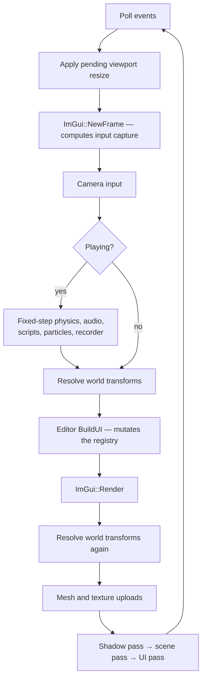

<div align="center">


**A Vulkan 1.2 game engine and editor, written from scratch in C++20.**

Data-oriented ECS core · physically based renderer · dockable editor · hot-reloadable C++ gameplay

[](#requirements)
[](#renderer)
[](#build)
[](#testing)
[](#code-standards)
[](LICENSE)

</div>

---

## What this is

Supersonic is a complete engine, not a renderer with a UI bolted on. Game state
lives in flat [EnTT](https://github.com/skypjack/entt) components; logic lives in
stateless systems over those components; every byte of GPU memory is allocated
through VMA. The editor is part of the engine rather than a separate application:
it edits the same registry the renderer draws and the physics steps.

It is a solo project, built to be read as much as to be run. Where the
implementation departs from the design, the departure is written down in
[ARCHITECTURE.md](ARCHITECTURE.md) instead of being left as an aspiration the
code quietly contradicts.

<div align="center">

<br>
<sub>The editor running the sample scene — shadow-mapped PBR, normal-mapped surfaces, skeletal animation, glTF and procedural geometry, live frame statistics.</sub>
</div>

---

## Features

### Renderer

| | |
|---|---|
| **Physically based shading** | Cook–Torrance GGX with metallic / roughness / ambient-occlusion inputs, per-material — as constants, as a packed ORM map in glTF's channel order, or both, since the map multiplies the constants |
| **Lighting** | Clustered forward: the view frustum is cut into 16x9x24 froxels and each fragment loops only the lights that reach it, so the count is bounded by what overlaps one small box rather than by the shader. Directional, point and spot, with distance attenuation and a smooth cone falloff; directionals are never clustered because they reach everywhere |
| **Cascaded shadows** | Four 2048² D32 cascades in one array image, fitted to the camera by bounding sphere and snapped to the texel grid so edges do not crawl; per-cascade normal offset, 3×3 PCF, and a cross-fade across each split |
| **Normal mapping** | Tangent-space, with glTF-convention `vec4` tangents (handedness in `w`) generated for procedural meshes too |
| **Frustum culling** | Gribb–Hartmann plane extraction; the scene pass culls against the camera, the shadow pass against the light, so nothing off-screen pops its shadow in and out |
| **HDR + bloom** | Floating-point scene target, luminance-thresholded bright pass with a soft knee, separable half-res blur, then tone map and sRGB encode — exactly one encode, at the end of the chain |
| **Transparency** | A blended pass after the opaque one and after the sky, sorted back to front, with depth writes off — per-material, and particles ride the same pipeline |
| **Alpha cutout** | A per-material alpha threshold discarded before shading, so foliage and grates keep a hard edge and stay opaque instead of sorting against themselves in the blend pass — and it reaches the shadow too: a leaf casts its holes, on a second depth pipeline that culls neither face, while a blended surface casts nothing rather than a rectangle |
| **Sky and fog** | A procedural gradient sky drawn as a fullscreen triangle where nothing else claimed the depth, and exponential-squared distance fog, both authored per scene |
| **Emissive** | A per-material emissive colour and strength, driven above 1.0 to trip the bloom threshold |
| **Texture sampling** | A generated mip chain and anisotropic filtering, both guarded on the device actually supporting them |
| **Anti-aliasing** | 4× MSAA, resolved into the image the editor samples |
| **Pipeline cache** | The driver's compiled pipelines persist to disk between runs, validated against vendor, device and driver UUID before reuse |
| **Grid** | Procedural infinite ground grid, depth-tested and analytically anti-aliased |

### Assets

- **glTF 2.0** import via tinygltf — meshes, materials, texture references, **skins and animations**
- **Wavefront OBJ** import
- **Textures** through `stb_image`, with per-material descriptor sets cached by texture pair
- **Procedural geometry** — cube, sphere, plane, and a heightfield **terrain generator**
- **Shared materials** as `.material` assets — one asset, many entities, edited once; create and assign them from the content browser, or detach an entity with *Make Unique*
- **Scenes and prefabs** as readable JSON (`.scene`, `.prefab`), parsed by a hand-written reader with no external dependency

### Simulation

- **Input** — named actions and axes over keyboard, mouse and gamepad; any bound source satisfies an action, so a pad and a keyboard drive the same game without either knowing about the other. The pointer can be **locked** for mouse-look: the editor takes it back between plays and losing the window always releases it, so a captured cursor cannot trap you
- **Fixed-step physics** with an accumulator capped so a hitch costs fidelity rather than exploding the solver
- **World queries** — raycast, sphere overlap and a ground check against *colliders* rather than render bounds, available to C++ and to hot-reloaded scripts
- **Collision** — sort-and-sweep broadphase; a narrowphase of four shapes and four pair tests, because a sphere is a capsule whose segment has no length: nearest points between segments for the round pairs, segment-against-box for a capsule or sphere against a crate, the separating axis theorem over fifteen axes with Sutherland–Hodgman clipping for box against box, and a heightfield for terrain — which is a function rather than a triangle soup, so the cells a shape can touch are an index range and the seams need no internal-edge filtering. Mass-weighted impulse response with Coulomb friction, slop-limited positional correction so stacks settle instead of vibrating, speculative contacts so a fast body lands on a wall rather than through it, immovable collider-only obstacles, and non-resolving trigger volumes
- **Joints** — point, distance and hinge constraints between two bodies or between a body and a fixed point in the world, solved in the same iteration as the contacts so a body held by a rope *and* resting on the floor satisfies both at once. A rope resists stretching only, so a chain can fold; the position pass sweeps four times re-reading as it goes, which is what makes a five-link rope hang at its length rather than half a per cent longer
- **3D audio** on XAudio2 with a from-scratch WAV decoder, inverse-distance attenuation and listener-relative panning
- **In-game UI** — text, panels, buttons and a text field, anchored so a HUD authored at one resolution survives every other; a script reads what was typed and hears it submitted
- **Particle systems** with per-emitter pools, so two emitters cannot starve each other
- **Job system** — a worker pool with a counter fence, used where the work is genuinely independent: terrain generation, per-vertex tangent bases and particle integration. Command recording, the transform hierarchy, scripts and collision response stay on the main thread on purpose, and the code says why
- **Skeletal animation** — glTF skins and animation channels with LINEAR, STEP and CUBICSPLINE interpolation; joints are reordered parent-before-child at load so a pose is one forward pass, the joint palette lives in a storage buffer indexed per draw, the shadow pass skins from the same palette, and the render bounds follow the pose so an animated character is not culled against its bind box
- **Scripting** — built-in components plus a **hot-reloadable C++ plugin**: rebuild the script target while the engine runs and the new code is swapped in without a restart

### Editor

| | |
|---|---|
| **Dockable layout** | ImGui docking with saved layout presets |
| **Hierarchy** | Full transform parenting via drag-and-drop, with cached world matrices |
| **Inspector** | Every component editable, with a dynamic *Add Component* menu |
| **Gizmos** | ImGuizmo translate / rotate / scale, `W` `E` `R` |
| **Selection** | Viewport raycast picking against real mesh bounds, not an assumed unit cube |
| **Play / Pause / Stop / Step** | Snapshots the scene on Play and restores it on Stop, so a scene can be authored, tried, and got back |
| **Undo / redo** | 64 steps over the scene serializer — `Ctrl+Z`, `Ctrl+Y` |
| **Animator** | Clip, speed, loop and a scrubbable time slider — poses evaluate every frame, so scrubbing shows the result immediately |
| **Time-travel rewind** | Scrub backwards through recorded simulation frames |
| **Fly camera** | The viewport has its own camera, so framing a shot in the editor does not move the game's |
| **Statistics** | Per-frame CPU zone timings, a frame-time graph plotted from the raw delta so a hitch is actually visible, entity count, draw/cull counts per pass, contact count, worker threads, script-host state |
| **Console** | Levelled, categorised engine log with substring filtering, mirrored to a file beside the binary |
| **Interface** | Inter and Font Awesome embedded in the binary, an accent palette from the engine's own branding, image thumbnails in the browser, a floating viewport HUD, and DPI scaling from the monitor |
| **Packaging** | One-click standalone build of the current scene |

### Platforms

Developed and tested on **Windows** with MSVC. **Linux** and **macOS** (MoltenVK)
build from the same tree.

**Android and iOS do not work, and the scripts under `platform/` do not change
that.** This section used to say those targets "configure and compile but are not
yet soak-tested". That was wrong in the worst direction — it read as *nearly
there* when neither got past CMake configure. Android now does, and stops at the
first file that needs a window:

- GLFW, its ImGui backend and its link are behind `if (NOT ANDROID)`
  (`CMakeLists.txt:147`, `:174`, `:319`), so an NDK configure no longer dies on
  X11 and Wayland. The compile then fails at `src/platform/Window.hpp`, which
  includes `GLFW/glfw3.h`, and at `vulkan/vulkan.hpp`, which the NDK sysroot
  does not ship — measured on 27 August and recorded under Phase 5 of
  [the Wolf Brigade port plan](docs/planning/2026-08-25-wolf-brigade-port.md).
  Nothing yet stands where GLFW would: no `ANativeWindow` surface path.
- `AndroidManifest.xml` expects a NativeActivity to `dlopen`
  `libSupersonicEngine.so`. CMake produces a static library and an *executable*
  (`CMakeLists.txt:209-210`), and there is no `android_main` or
  `ANativeActivity_onCreate` anywhere in the tree.
- `src/platform/AndroidNativeApp.cpp` has zero callers and is filtered OUT of
  every non-Android build (`CMakeLists.txt:188-189`).
- Audio has no Android branch (`CMakeLists.txt:334-347`), so Android gets the
  documented no-op and a port that booted would be silent.
- No platform delivers touch. `RawInputState` carries up to eight contacts and
  `Input` derives Began, Moved and Ended from them (`src/core/Input.hpp`), but
  the only thing that ever fills one in is the mouse — as contact 0 while the
  left button is held, which is how a gesture machine gets tested on a desktop.

[ARCHITECTURE.md](ARCHITECTURE.md) has said **"Not functional"** for both all
along, and so does the header of `platform/android/build_android.sh`. This file
was the one disagreeing with them.

---

## Getting started

### Requirements

| | |
|---|---|
| **Compiler** | C++20 — MSVC 2022, GCC 11+, or Clang 13+ |
| **CMake** | 3.20 or newer |
| **GPU** | Any Vulkan 1.2 capable driver |
| **Vulkan SDK** | Strongly recommended — see below |

Every third-party dependency is vendored under `third_party/`. There is no
package manager step and nothing to fetch: GLFW, GLM, EnTT, ImGui, ImGuizmo,
stb, tinygltf, VMA and the Vulkan headers are all in the tree.

> **On Linux, that is not quite the whole story.** GLFW needs X11 development
> headers to configure at all, and GLFW 3.4 defaults to building a Wayland
> backend and hard-fails with `Failed to find wayland-scanner` unless the full
> Wayland toolchain is present. ALSA's headers are what decide whether the
> engine gets real audio or compiles its documented no-op. What CI installs:
>
> ```bash
> sudo apt-get install -y libvulkan-dev libx11-dev libxrandr-dev >   libxinerama-dev libxcursor-dev libxi-dev libxkbcommon-dev >   pkg-config libasound2-dev
> cmake -S . -B build -DGLFW_BUILD_WAYLAND=OFF
> ```

> **On the SDK.** The engine builds and runs without it, falling back to the
> vendored headers and the loader that ships with your driver. But without
> `VK_LAYER_KHRONOS_validation`, invalid Vulkan usage does not produce an error
> message — it produces an access violation, or nothing at all until the code
> runs on someone else's hardware. The SDK also supplies `glslc`; without it
> CMake cannot rebuild the shaders and falls back to the committed SPIR-V, so
> GLSL edits are silently ignored. CMake warns when that happens.

### Build

```bash
# Single-config generators (Ninja, Makefiles) — build type is chosen here
cmake -B build -DCMAKE_BUILD_TYPE=Release
cmake --build build --parallel
```

```powershell
# Visual Studio is multi-config: it ignores CMAKE_BUILD_TYPE, so pass --config
cmake -B build -G "Visual Studio 17 2022" -A x64
cmake --build build --config Release --parallel
```

### Run

Asset paths resolve relative to the working directory, so **launch from the
project root**:

```bash
./build/SupersonicEngine                    # Linux / macOS
.\build\Release\SupersonicEngine.exe        # Windows
```

Visual Studio's debugger working directory is already set to the project root,
so <kbd>F5</kbd> works with no further setup.

Full command reference, including validation-layer setup, shader compilation and
the script hot-reload loop: **[AGENTS.md](AGENTS.md)**.

---

## How a frame runs

The frame order in `SupersonicApp::Run` is deliberate, and two of the steps are
load-bearing in ways that are not obvious.



- **The viewport target may only be recreated at the top of the frame.**
  Recreating it frees its framebuffer, images and ImGui descriptor set. Doing
  that after `ImGui::Image` has recorded the texture ID into the frame's draw
  data leaves a draw call pointing at a released descriptor — and
  `vkDeviceWaitIdle` does not save you, because the offending command buffer has
  not been submitted yet.
- **World transforms are resolved twice.** Once before the editor, so the gizmo
  and picking act on current matrices; once after, so rendering reflects the edit
  the user just made rather than lagging a frame behind it.

---

## Repository layout

```
src/
  core/        ECS components, systems, serialization, asset loading, scripting
  renderer/    Vulkan device, swapchain, pipelines, shadows, culling, registries
  editor/      Panels, gizmos, editor camera, undo history
  platform/    Window and OS integration
assets/
  shaders/     GLSL sources and committed SPIR-V
  branding/    Logo and mark
  models/  textures/  audio/  scenes/
plugins/       Hot-reloadable C++ gameplay scripts
platform/      Android and Apple target scaffolding
tests/         Pure-logic regression suites
docs/          Screenshots, and the planning records under docs/planning/
.github/       CI: manual-dispatch only (Actions -> CI -> Run workflow)
```

Roughly 19,200 lines of engine source across 73 translation units, or 26,700
lines counting headers — excluding vendored dependencies and the two
translation units that exist only to compile VMA and tinygltf.

---

## Testing

```bash
ctest --test-dir build -C Release --output-on-failure
```

Sixty-eight suites, each a plain executable with no test framework behind it —
pulling one in for pure-logic checks would cost more than it returns.

There is also a scene that exists to be rendered rather than to be played:

```bash
./build/Debug/SupersonicEngine.exe --frames 40 --fixed-step   --scene assets/scenes/AllPasses.scene --screenshot shot.png
```

`AllPasses.scene` puts every pass the renderer has into one frame — opaque
geometry, a multi-surface model, the sky, four blended panes across two
materials, and particles — and the `[Counts]` block it prints is what a change
to the draw path is checked against. It was written because the sample scene
does not: it reaches the blended pass through a shared material asset and
never with two materials in it, so **no before-and-after in this project had
ever exercised the blended batcher**, and a refactor of it would have been
verified by a screenshot of geometry it never touched.

| Suite | Covers |
|---|---|
| `test_transform` | Matrix and projection conventions |
| `test_hierarchy` | Parenting, world-transform caching, play/stop snapshots |
| `test_frustum` | Plane extraction, AABB transforms, the zero-to-one near-plane convention |
| `test_cascades` | Split distribution, slice fitting, texel snapping, depth range |
| `test_skeletal` | glTF skin import, joint reordering, all three interpolation modes, palette packing, and re-reading a re-exported rig |
| `test_raycast` | Viewport picking, slab intersection, depth ordering |
| `test_meshgen` | Primitive generation, winding, tangents, OBJ parsing |
| `test_gltf` | glTF import against real assets in the tree, including a `.glb` with embedded textures |
| `test_serialize` | JSON reader, scene and prefab round-trips |
| `test_undo` | Undo/redo stacks, redo invalidation, snapshot round-trip stability |
| `test_materials` | Material asset round-trip, shared edits, Make Unique, link persistence, reloading in place, and not reading our own save back |
| `test_input` | Action mapping, press/release edges, stick deadzone, gamepad fallback |
| `test_jobs` | Dispatch coverage, the Wait fence, throwing jobs, pool restart |
| `test_physics` | Integration, broadphase, narrowphase, mass-weighted response, triggers, raycast and overlap queries |
| `test_heightfield` | Terrain collision: the grid against the mesh vertex for vertex, seams, ridge crests, grooves, buried recovery, and the cell march a ray does |
| `test_joints` | Constraint arithmetic: momentum conservation, the rod/rope difference, off-centre anchors, the hinge axis, limits, motors, welds, and every degenerate case |
| `test_convexhull` | Hull building and collision: Euler's formula, convexity, a cube's six faces, the vertex cap, agreement with the box path, and dropping only the hulls built from an edited file |
| `test_decomposition` | Concave collision: watertightness, the L's volume against its hull's, that the pieces cover the mesh and invent nothing, and that the notch stays empty |
| `test_environmentmap` | IBL on the CPU: the cube face mapping, a constant sky irradiating to itself, both prefilter endpoints, and the Radiance decoder |
| `test_assetdatabase` | Asset identity: minting, sidecars, rename-by-content adoption, which route a reference resolved by, and re-pointing a scene that is already open |
| `test_audio` | WAV decoding including the shipped clip, and reloading a clip without freeing what is playing it |
| `test_scripts` | Script registry and dispatch |
| `test_blending` | Cross-fade between clips, blend weights, clip switching |
| `test_spotlight` | Cone angles, the straight-down lookAt collapse, shadow frustum fit |
| `test_pointshadow` | Cube-face view matrices, slot assignment, per-light indices |
| `test_uicanvas` | Canvas layout, anchoring, rect resolution |
| `test_uiinput` | UI hit testing, press and release routing |
| `test_mixer` | Voice mixing: volume, summing, clamping rather than wrapping, looping, pitch and sample-rate conversion, panning, mono and 8-bit clips. There is no bus gain to test — the only volume is per voice |
| `test_gameruntime` | Manifest parsing, packaged-game detection, executable-relative paths |
| `test_launchoptions` | Argument parsing, missing values, malformed counts |
| `test_json` | Depth limit, trailing content, duplicate keys, malformed input |
| `test_scenemanager` | Deferred loads, Save As, failed-save and failed-load behaviour |
| `test_assetwatcher` | Change detection, deleted and restored files, duplicate watches, and a write the engine made itself |
| `test_contacts` | Enter/stay/exit diffing, pair ordering, normal direction, triggers |
| `test_sat` | Oriented box collision, face manifolds, the ramp an AABB could not represent |
| `test_lightselection` | Which lights survive the eight-light cap, and that the sun is not one of the casualties |
| `test_shadowcache` | The signature that lets a depth pass be skipped, and what must dirty it |
| `test_resourcesync` | The signature that lets an entity's mesh and texture resolve be skipped |
| `test_determinism` | That one binary over one scene produces the same frames twice |
| `test_replay` | Recording a run's input and reading it back: levels carry, edges do not, floats keep their bits, and a truncated file is refused. Also the POINTER — where it is, and the touches on it — which is what makes a session played with a mouse reproducible, and the capture function the engine actually records through, which nothing reached before |
| `test_camera` | That the fly camera can be turned off, in both halves, that a scene written before the switch existed still flies, and that the editor's own eye can go flat and come back |
| `test_sprite` | Where a cell of a sprite sheet is, when a flipbook advances, that a one-shot stops on its last frame rather than its first — and that the state hash sees which frame it is on, while ignoring the grid it was authored with |
| `test_tilemap` | Where a cell sits in the world and in the atlas, that a flip swaps one axis and leaves the other, that a map is uploaded once and then replaced behind the same id rather than re-uploaded per stroke, that an emptied map stops drawing instead of showing the fallback cube, and that the state hash sees the cells and not the atlas |
| `test_renderplan` | What a pass costs before any of it is recorded: that a run of identical draws is one call, that a batch closes on every change that has to be bound and on nothing else, that the order is never re-sorted, and that a full instance buffer drops draws and says how many |
| `test_nav` | That the oracle sees a wall move before anything else is worth having, that a diagonal never cuts the seam between two walls, that a goal on a wall is refused rather than flooded from, that cut off is a different answer from far away, and that an exact tie falls the same way every time |
| `test_layerstack` | The seam a game lives in: attach, detach, fixed and per-frame callbacks |
| `test_codecextension` | Serialising a game's own components alongside the engine's |
| `test_packaging` | That a packaged folder has a binary, a manifest, and the scene it was asked for |

Every suite is a regression test for a bug that actually happened. The header
comment on each one says which.

### Code standards

- MSVC `/W4` and GCC/Clang `-Wall -Wextra -Wpedantic`, **zero warnings**
- Vendored sources are excluded from the warning level, never the project's own
- Validation layers and synchronization validation clean before any commit that
  touches the renderer

---

## Concave collision, and why the method was chosen for its oracle

A hull is convex by definition, so a doughnut collided as a disc and a chair as
the block it sits in. A collider is now a **decomposition** — one shape as the
several convex pieces that make it up.

The hard part of a decomposition is not writing one. It is knowing whether the
one you wrote is right, and the usual answer is to look at it. So the method was
picked for what it makes checkable: splitting a closed mesh by an axis-aligned
plane and clipping the triangles leaves the two halves separated by that plane,
so the pieces are interior-disjoint and **their volumes add**. Two exact bounds
follow, and they are the entire justification for a BSP over the voxel method
that would give prettier pieces:

| | |
|---|---|
| sum of the pieces ≥ the mesh | nothing was dropped — no hole to fall through |
| sum of the pieces ≤ the convex hull | nothing invented that one hull did not already have |

On the L fixture both are met *exactly*, against figures derived by hand from
the shape rather than read off the code: the L has volume 3, its convex hull 3.5
by the shoelace formula over the pentagon that drops the reflex corner, and the
split at x = 1 gives a 1×2 slab and a 1×1 cube summing to 3 with nothing
invented. And the feature stated as a single point in space: **(1.3, 1.3) in the
L's plan is inside the single hull and outside every piece.** That is the hole.

Two things had to be corrected while writing it, and both were found by the
tests rather than reasoned around afterwards.

**The split criterion cannot use the halves' own mesh volume.** Clipping leaves
each half open where the cut passed through — the walls are there, the cap over
the cut is not — and the divergence theorem hands an open surface a number that
looks like a volume and is not one. The criterion is hull volume alone, which
needs no cap.

**The L fixture was not watertight on the first try.** Cutting its face into two
rectangles shares only *part* of an edge, which is a T-junction: geometrically
closed, topologically not. That is what `IsClosed` is for — a concavity measured
on an open mesh is a number with no meaning, and it still looks like a number.

The narrowphase keeps every piece's contacts rather than the deepest piece's,
each with its own normal, which needs nothing new from the solver: terrain has
had per-point normals since heightfield collision landed. Keeping all of them is
the difference between a chair that rests on its seat *and* its legs and one that
rocks between them a step at a time.

A shape that was already convex comes back as exactly one piece equal to its own
hull — asserted differentially against `ConvexHull::Build` — so every existing
collider behaves as it did.

**A hull on terrain** used to collide as the oriented box containing it, so a
wedge on a hill rested on a corner of something nobody could see.
`Heightfield::CollideHull` is not a fourth contact model: `CollideObb` *is* that
function specialised to a cube, since its eight corners are the cube hull's
eight vertices and its least-exit-axis is what `ClosestPointOnHull` computes for
a point inside any convex shape. So a cube hull placed where a box is must
produce the same manifold contact for contact, across five arrangements — and
does.

## Hot reload, and the asset that cannot be dropped

Textures and meshes have re-read themselves since the watcher landed.
Materials, rigs and sounds did not: all three cache by path, all three answer
from the cache without stat-ing anything, and none had any way to be told the
file underneath had moved on. Editing a `.material` in a text editor did nothing
until a restart, and an animator re-exporting a character saw whatever skeleton
happened to be on disk when the editor started.

Three of the four re-read **in place, keeping their id**. An id is an index into
the library's vector and every component in the scene is holding one, so minting
a fresh entry leaves them all rendering the values from before the edit — the
same bug, quieter.

Five things were not obvious:

| | |
|---|---|
| **A cached miss has to be repairable** | Both libraries deliberately remember a file that failed to load, so a broken reference is not retried every frame. That means fixing the file on disk — the way anyone would expect to clear it — otherwise achieves nothing for the rest of the session. |
| **A rig needs a generation, not just an id** | A reload replaces contents without changing the index, so the joint palette and the captured bind-pose bounds go on describing the previous export. The joint-count resize hides it whenever the count matches, which for a re-export is almost always. |
| **The engine reads its own writes** | The inspector edits a material in place and saves it. The mtime moves, the next poll fires, and the reload puts the file back over the values still being dragged — which looks harmless, because it reads back what was just written, until the frame where the slider has moved on. |
| **Audio cannot be dropped at all** | A voice reads the clip's sample buffer directly. XAudio2 is handed `clip->pcm.data()` and reads it from its own thread; the software mixer keeps a `const AudioClip*` whose contract is written down as "the clip must outlive the voice". |
| **The collision shape counts as an asset** | Re-uploading an edited mesh moves what you *see*. The hull built from it is a separate cache, so leaving it alone means the object looks edited and behaves as though it is not — and nothing on screen says which of the two is lying. |

So audio stops the voices, **then** drops the clip, **then** clears the handles
the components hold. Each other order is wrong in its own way: dropping first is
the use-after-free, and clearing the handles first loses the ids needed to stop
those voices, which then play the old sound until the scene closes.

The part that is easy to get wrong is *which* voices. Asking the components
which of them name this file is the obvious answer and it is incorrect —
`Update` starts a voice and then never looks at `soundFile` again, so pointing a
looping source at a different file leaves the old voice running on the old clip.
That voice, whose component no longer names this path at all, is exactly the one
reading the memory about to be freed. `AudioEngine` records what each voice is
actually playing and answers the question itself.

**A rename now reaches the scene that is open.** Identity has survived a rename
since asset identity landed, but only through the file: a loaded component holds
a path and nothing else, because the guid that would resolve it was spent when
the scene was read. Import now reports where each adopted identity came *from* —
recorded during adoption, since Import clears its path index before adopting and
no diff of the result can reconstruct the old path afterwards — and the editor
rewrites the open scene to match. The old path comes from the sidecar's own
**name**: a `.meta` stores a guid and a hash and never a path, because the path
is the one thing about an asset that is allowed to change. Reading `entry.path`
gives an empty string, which matches nothing, which re-points nothing — the
whole feature doing nothing at all while every part of it appears to run. That
is what the test caught, on the first version of this.

Matching is on the whole path, never the file name. A project is full of a
`floor.png` per folder, and a rewrite that matches too eagerly is worse than one
that does nothing: it points an object at somebody else's texture and the scene
still renders, so nothing says which object went wrong. Cached materials are
re-pointed too — `MaterialSystem::Sync` copies a shared asset's texture paths
onto every component using it every frame, so rewriting only the components puts
the stale paths straight back within one frame.

That last point turned out to be a defect of its own and is now fixed: `Update`
started a voice and never looked at `soundFile` again, so changing the file on a
*looping* source did nothing at all until somebody toggled Playing. The question
is asked of the engine, which records what each voice is reading, rather than of
the component, which records only what it asks for.

## Image-based lighting

The environment used to be two colours mixed by height, so a metal surface
reflected a gradient and a sky brighter than white could not exist. A Radiance
`.hdr` is now convolved into two cubemaps — the diffuse irradiance a surface
facing each direction receives, and a specular chain indexed by roughness — and
the shader samples both.

**This was deferred three times**, on the grounds that its natural check is
"does it look plausible", which this project rejects as evidence. That turned
out to be the wrong question. IBL is four pieces and three of them have exact
oracles:

| piece | how it fails | the oracle |
|---|---|---|
| the cube face mapping | a reflection that comes from the wrong direction, invisibly | a direction turned into a face and back is the direction it was |
| the irradiance integral | a botched solid angle, or a normalisation off by π | the cosine integral over a hemisphere, over π, is **one** — so a constant sky irradiates to that constant |
| the prefiltered chain | energy spread where it should not be | roughness 0 is the environment itself; every roughness of a constant sky is that constant |
| the shader combining them | no CPU oracle exists | see below |

The fourth is checked **differentially**, against code already trusted rather
than against a number somebody wrote down: with the scene's sky and ground
ambient set to one colour, and an environment map of that same colour, the two
paths must produce the same image. They produce the *same bytes* — 0 of 293,695
pixels differ. That single result exercises the `.hdr` decode, the
equirectangular projection, both convolutions, the half-float conversion, the
cube upload, the descriptor bindings and the shader, end to end.

And the other direction: a real HDRI with a sun sixty times white changes
184,884 of 248,395 scene pixels while leaving the procedural sky — which IBL
does not touch — identical in all 45,300 of its own. The zero there is the
control that says the two runs are otherwise the same run.

Three things are load-bearing:

- **A scene that names no environment renders byte-for-byte as it did before
  any of this existed.** The shader branches to the original expression, and
  the check is the same one: a render of MainScene after this landed is
  identical to one from before it. That is what made the change safe to land
  without re-checking every scene in the project.
- **Both cube samplers are always bound.** Reading a descriptor nobody wrote is
  undefined even inside a branch the shader never takes, so a scene with no
  environment binds a one-texel black cube and a flag in the scene block says to
  ignore it.
- **Loading rewrites the two bindings rather than reallocating the sets.** The
  descriptor pool holds exactly one set per frame in flight, so allocating a
  second round exhausts it — the first scene that named an HDRI died on
  `ErrorOutOfPoolMemory` before it drew anything.

The format is Radiance `.hdr`, both encodings. Six PNG faces would have avoided
the parser and cannot hold a value above one, which is most of the point: a sun
is thousands, and clamping it throws away exactly the range that makes a
reflection look like light. Storage is `R16G16B16A16_SFLOAT`, the only HDR
format whose linear filtering every Vulkan implementation must support — and an
over-range value is clamped to the largest finite half rather than to infinity,
because an infinity in a colour becomes a NaN the first time the ambient
occlusion term multiplies it by zero.

**The sky is the environment too.** Reflections came from the cubemap while the
background stayed the analytic ramp, so a chrome sphere showed a room and the
space behind it showed a gradient. The sky pass already computed a world-space
view ray and already binds the cubes, so it samples level 0 of the prefiltered
chain — which is roughness zero, which is the environment itself. The whole
procedural sky goes when one is loaded, sun included: a photographed sky has its
own sun in it, and drawing another over the top would light the scene from one
and show the other.

That level stopped being expensive at the same time. The prefilter spent 128 GGX
samples per texel on it, where the lobe is a delta and every sample lands on the
same direction — it was paying to arrive back where it started. Making it a
straight resample is not an approximation, it is the integral's closed form, and
it is what paid for doubling the resolution now that a background rather than a
small bright smear is reading it.

**And more than one of them.** A `ReflectionProbeComponent` is a box; an object
whose bounds centre falls inside it lights from the environment that probe
names rather than from the scene's. Two are bound at once, which is what "a room
and the outdoors" needs.

Two device features decided the shape of it, and neither is enabled here. A
cubemap ARRAY needs `imageCubeArray`, so the probes are an array of separate
sampler descriptors instead — the idiom binding 3 already uses for the
point-shadow cubes. And indexing a sampler array by a push constant needs
`shaderSampledImageArrayDynamicIndexing`, so the shader picks between the slots
at LITERAL indices and lets the comparison choose between the results, which is
the shape `pointShadowFactor` already had to take after this engine got caught
by exactly that. A `static_assert` guards the count, because a comment would not
have stopped anyone raising it.

The fixture is built so it cannot pass by accident: the scene names no
environment of its own and only the probe names one, so outside the box is the
analytic hemisphere and inside is the probe's HDRI. Two mirror spheres, one in
and one out, and the runs differ only in whether the probe names a file —
**10,490 pixels differ inside it and 0 outside**. The zero is the claim.

The first version of that fixture removed the probe *entity* rather than
blanking its path, and the control came back 474 instead of 0: changing the
entity count changes which two entities the headless self-check mutates at frame
N/2. The fixture was wrong, not the feature — and a control that was merely
small would have hidden it.

## Asset identity

Every asset reference used to be a raw relative path, so renaming a file in
Explorer broke every scene, prefab and material pointing at it. **Silently** is
the whole problem: the texture is gone, the fallback checkerboard appears, and
nothing says which of forty references used to work.

Each asset gets a `.meta` sidecar beside it — `floor_tiles.png.meta` — holding a
32-character identity and a content hash. That is the one place it can live and
still be copied by a packager that copies directory trees, moved by a person who
moves the asset, and diffed by git.

A saved reference carries **both** the identity and the path:

```json
"AlbedoTexture": "assets/textures/floor_tiles.png",
"AlbedoTextureGuid": "320e51673e6f8a91c3d06bca0efebea9",
```

Both, not either. The identity is what survives a rename; the path is what makes
the file readable and mergeable, and it is the migration story — every scene
written before identities existed has a path and no identity, and goes on
working unchanged.

**Renaming is recovered by content.** Explorer has never heard of a `.meta`, so
a rename leaves the sidecar behind under the old name and the asset arrives with
no identity at all. `--import-assets` matches orphaned sidecars against
un-identified files by their contents and carries the identity across. The
ordering is the feature: mint first and every renamed file gets a brand new
identity, adoption finds nothing left to adopt, and the headline case silently
does nothing while every counter still reads like success.

**Scanning creates nothing.** A scan runs from load paths and from tests, and
one that minted as a side effect would have the test suite writing sidecars into
your assets folder the first time you ran it. `Scan` reads; `--import-assets`
writes.

**A fallback is counted, not hidden.** When a reference carries an identity
nothing answers to, the saved path is used *and* the database counts it and logs
a warning — because a fallback that looks like success is worse than no feature:
it is the old broken behaviour wearing the new one's clothes. Every test asserts
which route a reference resolved by, since one that only checks the answer also
passes when the fallback happened to be right.

```
SupersonicEngine --import-assets
```

mints identities, then re-writes the `.material` and `.scene` files that
reference them so they carry the identities too. A scene is written to a string,
read back, and written again; it is only committed when the two strings are
identical — a fixed point, which is a far stronger statement than "the same
number of entities came back".

**Not done, and separable:** a rename made while the editor is running is only
picked up at the next import — nothing re-points a live scene. Prefabs
deliberately keep only the shape of a reference and not its target, because a
prefab cannot name an entity in a scene it is not part of.


## Roadmap

Split into what is done and what is next, because a list on which every box is
ticked has stopped being a roadmap. The README is already comfortable calling
Android "not functional"; extending that register forward costs nothing.

## Shipped

- [x] PBR, normal mapping, cascaded shadow maps, point and spot shadows
- [x] HDR pipeline with bloom, 4× MSAA, a procedural sky and distance fog
- [x] A sorted transparent pass, and emissive materials that drive the bloom
- [x] Shadows that know what a material is: a cut-out surface casts its own
      silhouette rather than its bounding rectangle, and a blended one casts
      nothing at all — per SURFACE, so a model whose holes are on its fourth
      material casts them rather than the silhouette of its first
- [x] Reflection probes: more than one environment in a scene, so a room and
      the outdoors it opens onto no longer light identically
- [x] Concave collision: a collider is the convex pieces a shape decomposes
      into, so a doughnut has a hole in it, and a hull on terrain lands on the
      hill rather than on a box around it
- [x] Joints with limits, motors, breaking, welds, springs authored as a
      frequency and a damping ratio, and an author-controlled solve order
- [x] Hot reload for every asset a scene names — textures, meshes, materials,
      rigs, sounds and the collision hulls built from them — and a rename
      followed into the scene already open
- [x] Transform hierarchy, prefabs, scene and material serialization
- [x] Play/Stop, undo/redo, time-travel rewind
- [x] Frustum culling, persistent pipeline cache
- [x] Oriented-box collision by SAT, speculative contacts, a batched solver and
      sleeping — with world queries against colliders rather than render bounds
- [x] Job system, applied where the work is provably independent
- [x] Skeletal animation with cross-fade blending
- [x] In-game UI canvas, audio mixer, one-click packaging
- [x] Headless `--frames` runs, a validation gate that fails the build, a CPU
      profiler and a levelled log with an editor console
- [x] A layer seam a game lives in, a simulation clock that reproduces, and a
      serializer a game can extend with its own components
- [x] Assign a mesh, a texture or an audio clip by dragging it from the content
      browser; meshes, textures and prefabs reload when the file changes
- [x] glTF materials — base colour, metallic, roughness, the base-colour AND
      normal maps, emissive with `KHR_materials_emissive_strength`, and
      `alphaMode` — imported onto the entity when a model is assigned
- [x] `.glb` support: a single-file export used to fail to load outright, over
      a texture. Embedded images are extracted to `cache/` verbatim, so every
      texture in the engine stays a path
- [x] More than one scene, switchable at runtime by a layer or a script
- [x] Mouse capture: a script can lock the pointer, the camera looks without a
      button held, and losing the window always gives it back
- [x] Text input: a HUD text field a game can author, type into and read back,
      with the keyboard taken from the game while it has focus
- [x] Image-based lighting: a Radiance `.hdr` convolved into diffuse
      irradiance and a roughness-indexed specular chain, so metal reflects the
      room rather than a two-colour gradient
- [x] Convex hull colliders, built from the mesh you can see, with a
      non-uniform scale that is exact rather than approximated
- [x] Hinge limits, motors, breaking forces and welds — a door that stops at
      ninety degrees, a powered wheel, a rope that snaps under load, and two
      dynamic bodies rigidly fixed together
- [x] Asset identity: a `.meta` beside each asset, an identity written next to
      every saved reference, and a rename recovered by matching contents, so
      renaming a texture in Explorer no longer breaks the scenes that name it
- [x] Roughness, metallic and ambient occlusion as a packed map, in the channels
      glTF packs them into, multiplying the per-material constants rather than
      replacing them
- [x] Clustered forward lighting: the eight-light cap is gone. The frustum is cut
      into 16x9x24 froxels and a fragment loops only the lights that reach it
- [x] A place for a game to save: `UserDataDirectory` resolves `%APPDATA%`,
      `~/Library/Application Support` or `$XDG_DATA_HOME`, so a save survives an
      install into a folder the player cannot write to and a shortcut that
      starts the game from somewhere else
- [x] What a frame costs in QUANTITIES, not only in milliseconds — drawables,
      blended drawables, draw calls, particles, shadow casters and skinned
      matrices, reported by `--frames` under `[Counts]` as a median and a worst.
      Draw calls were never counted before, and are not the same number as
      drawables: the demo scene draws eight in nine, and drew eight in ten
      until instancing collapsed a consecutive pair
- [x] A game declares the window it opens at, in its manifest, with `--window
      1920x1080` to override it for one run. It is the render resolution too:
      in game mode the offscreen target follows the window
- [x] Nearest-neighbour texture filtering, asked for by the asset's `.meta` and
      not by the material that uses it — so pixel art stays sharp, and two
      materials naming one file cannot disagree about it
- [x] A sound is freed once it has finished. `Play` minted a voice per call and
      only an explicit `Stop` ever released one, so a game playing
      fire-and-forget one-shots accumulated a live voice per sound for the
      whole session
- [x] Instancing: the per-draw record moved out of the push constant and into a
      storage buffer a draw indexes by `gl_InstanceIndex`, so consecutive
      compatible draws go down the wire as one. Twenty thousand and one draw
      calls become four, and Scene Record goes 5.72 → 3.41 ms at twenty
      thousand drawables and 2.77 → 1.59 at ten thousand. Consecutive only,
      never a re-sort: the opaque pass's `sortKey` order is load-bearing, so a
      batch closes the moment the mesh, the index range or the material set
      changes. The blended pass and the particles get records and are
      deliberately not batched — they are drawn back to front, and an order
      between them is not something a batch may choose
- [x] …and then they were, because that reason was wrong. Vulkan orders the
      instances of one draw by instance index, and primitive order is what
      rasterization order is derived from — so a back-to-front pass can be
      batched as long as the records are written in that order. Twenty thousand
      particles cost one draw call rather than twenty thousand. Worth knowing
      what that bought: 0.29 ms of 3.29, because a bare draw call with no state
      change between them is about 15 ns. The expensive part of a draw was never
      the call, it was the 128 bytes pushed with it
- [x] A 2D scene can be authored in the editor. The projection, the
      orthographic matrix, the picking branch and the serialisation had all been
      there for months, and nothing in the editor could write any of it — so the
      only way to make a camera orthographic was to type it into the scene file
      by hand. There is a Projection control on the camera now, and a **2D View**
      that pans on a right-drag and zooms on the wheel. It does not fly forward,
      because under a parallel projection that changes nothing you can see
- [x] Point and spot lights land in the right place under an orthographic
      camera. The froxel grid cut the view into a widening pyramid built from
      `fov` — a field an orthographic camera never reads — while the shader
      assigned fragments to froxels by screen tile, so the two halves disagreed
      about where a froxel was and a lamp lit the wrong column of the image
- [x] Sprite sheets play as flipbooks, on the simulation tick and therefore
      inside the replay. Every piece of this was already here — the texture
      coordinate transform, its per-frame slot buffer, the nearest filtering
      that keeps the cells crisp, and the arithmetic for a sixteen-frame strip
      with a test already on it — and nothing on the tick had ever written a UV.
      A game could always animate one from its own layer, so this is an
      authoring story rather than a new capability: a grid, a rate, and it
      plays. The frame index is in the state hash, because a tick writes it and
      the next one reads it; the grid it was cut from is not, because retuning
      an animation is an edit and not a divergence
- [x] A tilemap is one mesh. The shape was decided before the code was: one
      entity per tile is what the sprite path already draws, and instancing
      folds identical quads into one call — but every cell showing a different
      tile needs its own texture-coordinate slot, there are 4,095 of those, and
      a map of a few thousand tiles would have run the buffer out on its first
      frame, for geometry that never moves. So a map bakes to one quad per
      occupied cell with the atlas cell written into its vertices, uploaded
      once and replaced in place when a cell changes. The atlas is cut by the
      same arithmetic a flipbook uses, so an index means one picture
      everywhere. Painted in the viewport with a brush, saved one map row per
      line so the file reads the way the screen does, and in the state hash —
      the cells, not the atlas — because a wall knocked down on a tick is state
      the next tick reads. Building it was the first call
      `MeshRegistry::Replace` ever had, and it was wrong twice: a dead slot per
      call, and a section still naming the index count it had just replaced
- [x] What a render pass costs can be answered before it is recorded. Three
      passes batched consecutive draws and each wrote the rule out for itself —
      the opaque one keyed on mesh id, index range and material set, the
      blended one on a mesh pointer and a material set, the particles on
      nothing at all — and none of the three was reachable by a test, because
      the numbers came out of a five-hundred-line function needing a command
      buffer, a device and two registries. This engine's own plan says **assert
      counts, never milliseconds**, and until now not one suite asserted on any
      cost quantity: "one draw call per drawable" was false for a year and
      nothing could have said so. `RenderSystem::PlanPass` is that decision as
      a pure function over numbers, and the recorder does what it says rather
      than deciding again, so a counter and a submission cannot drift apart.
      Ten thousand cubes cull to 6,200 drawables and cost **two draw calls and
      one mesh bind**, which is now asserted rather than asserted about
- [x] The renderer says how many binds a frame made, in three numbers rather
      than one — pipeline, mesh and material. The draw-call counter records
      that batching happened; these record what it was for, and a fused
      `stateChanges` would hide which of the three moved when they cost
      different things and are fixed by different work. Shipped as two commits
      on purpose: the first ran the new decision beside the three old loops and
      logged any disagreement, and only once it had agreed on every scene did
      the second delete them. The control that makes the null diff evidence is
      one word — forcing every batch to close moves the draw calls from 12 to
      15 on the fixture below while not one pixel changes, which is exactly
      what batching is supposed to be
- [x] Navigation, as a grid of integer costs and the flow field that solves it.
      A flow field rather than a path per unit, because the game shape in front
      of this engine is an RTS: A\* answers "how does *this* unit get there"
      and costs a search per unit, while a field answers "from anywhere, which
      way" and costs one search for the whole army. **Integers everywhere**, and
      that is the determinism claim rather than a micro-optimisation — floating
      point addition is not associative, so a frontier expanded in a different
      order gives a different total, and two machines that disagree about a
      distance disagree about where a unit walks. It is also why no navmesh is
      vendored. The queue is an ordered map rather than a heap because
      `std::priority_queue` says nothing about equal elements and equal
      distances are the *ordinary* case on a uniform grid — the same defect
      already fixed twice here, in the blended draw sort and the particle sort.
      A diagonal never cuts the seam between two walls, a goal on a wall is
      refused rather than flooded from, and unreachable is a different answer
      from far away, because a unit can act on it. It is **not a component**:
      a game owns one the way it owns its match state and puts it in the oracle
      through the state hash's contributor seam, because neither game in front
      of this engine would read an authored one — and the commit that adds the
      component should be the one that has a caller to shape it
- [x] A scene can say what is behind everything. It could not: the sky pass ran
      whenever a sky pipeline existed, which is always, and the colour behind it
      was a literal in the renderer — so every scene in every genre got a
      procedural horizon, and the only way not to have one was to cover the
      screen in geometry. For a 2D game that is most of the frame, and it is the
      first thing an art director picks. There is a **Background** control on
      the scene now: the sky, or a flat authored colour. Choosing the colour
      does not paint over the sky, it stops recording it. What that saves is a
      call and a pipeline bind, and it is worth being exact that the saving is
      *constant* rather than proportional: on a scene holding nothing else the
      sky costs one draw call and two pipeline binds against the colour's zero
      and one, and on the twelve-drawable AllPasses fixture the same choice
      takes twelve calls and four binds down to eleven and three. The sky is
      recorded between the opaque and blended passes precisely so depth
      rejection makes its *shading* nearly free, so what is being removed is
      the submission, not the pixels. It lives in the scene's render
      settings, so it is saved, undoable, and restored by Stop, none of which
      it had to be told about. The picker converts to linear, because the
      composite at the end of the chain encodes once and would otherwise encode
      it twice
- [x] In-game text wraps. It never did — not clipped, not truncated, but a
      briefing, a debrief or a tooltip rendered as a single line running off
      both edges of the display, with the only workaround being the game
      splitting the string itself against font metrics the engine has and did
      not expose, at a size the engine scales and the game does not know. A
      label carries a wrap width now, in authored units like every other size,
      and zero is one line however long, which is what every saved scene
      already has. **Three places have to agree about where the lines break**
      and only one of them is the draw: the measurement that places a
      right-anchored label needs the wrapped width, the drop shadow has to
      break where its own glyphs do, and the stack measurement has to report
      the wrapped *height* — a stack that measured a paragraph unwrapped
      reserves one line and lets the rest print over what comes next. A
      mutation run is what found the last two: the first tests all hung off the
      top-left, where a width decides nothing, and all ran at exactly the
      reference height, where the scale factor is one
- [x] A UI image can be cut into nine, so a frame keeps its corners at any box
      size. A panel, a button, a well and a tooltip are one PNG each with a
      bevel drawn into them; stretched whole, a 16-pixel corner on a 400-pixel
      box becomes a 100-pixel one, and the way out was one asset per distinct
      box size. The border is four numbers in texture pixels, because a frame
      is rarely square and because re-exporting the art at another resolution
      should change the texture size rather than the number the author typed.
      The arithmetic is a pure function outside the draw loop, since nine
      rectangles and eighteen texture coordinates is exactly the sort of thing
      that is off by one edge and looks almost right. **A box too small for its
      own frame is refused rather than folded**: the naive arithmetic gives a
      middle of negative width whose patches overlap and read as a doubled,
      mirrored frame, and shrinking the borders to fit would silently redesign
      the art — so it falls back to the plain stretch, and the author sees the
      frame they drew, smeared, which is a symptom you can read
- [x] A panel can confine its children, **at draw and at hit test together**.
      There was no way to say "and no further" about anything: an element whose
      contents outgrew their box painted over the neighbouring panel, and a
      scroll view was inexpressible — moving the rows up is arithmetic a game
      can already do, but without a clip they are drawn above the panel rather
      than disappearing into it. Both passes in one commit is the point rather
      than a nicety: a clip that hides the picture and not the hit leaves a row
      out of sight that still takes the press, which is this engine's own
      hidden-container defect wearing different clothes. Nested clips
      intersect, and a clip closed to nothing is treated exactly as hidden.
      Mutation testing found the measurement was wrong before it found the
      code was — reading ImGui's vertex buffer cannot see a clip at all, since
      the rectangle lives on the draw command and the scissor does the work, so
      the tests walk the command buffer and count only what survives. That is
      what then exposed the real bug: a scroll view inside an ordinary frame
      was skipped as a root and reached by no recursion, because the rule asked
      whether it had a parent rather than whether an ancestor clips
- [x] **The game can be played.** The Wolf Brigade port was complete and
      untouchable: four thousand lines of simulation verified against
      twenty-two of the original's own harnesses, a HUD, menus, audio and
      saves — and a search for `Input::` across the whole game found nothing.
      Selection, orders and build placement were ported, mutation-tested, and
      called only by their own suites, so the engine's flagship demonstration
      rendered a simulation it took no part in. Two things were missing and
      only one was the game's. A layer gets a registry and a delta, and the
      rectangle the frame was drawn into was known to the editor alone — so a
      layer holding its own camera could not turn a pointer into a point in its
      own world, which is the one conversion every click in every game needs.
      A scene's viewport is published now, with whether the pointer is the
      game's at all, since a point inside the rectangle can still be under a
      tool window. The rest is one function that reads the contacts, steps the
      already-ported gesture machine and hands the answer to the simulation.
      The bug that made it look correct while doing nothing: the placement-mode
      setter *abandons* the gesture in progress by design, so calling it every
      tick as though it were a state assignment cleared the tracked finger
      every tick and no gesture could ever complete

### Next

Ordered by what it costs against what it unblocks, not by how interesting it is.

**It is not empty any more, and measuring it against two real games is what
filled it.** An engine judged in isolation has no gaps; an engine asked to host
something has as many as the thing needs. Ten were closed on 27 August and
are in the log — most recently the UI image element, the texture coordinate
transform, and glTF animation without a skin, which between them are a minimap,
a fog overlay, a portrait, scrolling rain, a flipbook flame, and every one of
HUSK's nineteen animated models. What is left is here.

**For a game that generates its world**

- **Animated bounds are looser than they need to be.** `AnimationSystem` widens
  an animated entity's render bounds by carrying the whole bind box on every
  joint, which is safe and about 1.5–2.5× larger than the posed mesh. The cost
  is draw calls, and an editor AABB pick that claims empty space beside a
  character.
  A per-joint bind-space box would tighten it; no game here has needed it yet.
  (This replaces a claim that a dead `Skeleton::skinRadius` field meant animated
  meshes were culled against their bind pose. They are not — the widening has
  always been there, by a different and stricter mechanism, and the field has
  been removed.)
- **A surface override replaces numbers, not maps.** `SurfaceOverridesComponent`
  re-materialises a named surface's colour, roughness, metallic and emission.
  It deliberately does not swap the surface's textures, because that needs a
  per-override texture resolve and nothing has asked for one — HUSK's models
  carry no textures at all.

**For a game seen through a flat camera**

- **A tilemap stops at 65,536 cells, and it has no collision.** The cap is
  there because a tile is four of the renderer's 80-byte vertices — the 3D
  vertex, carrying a tangent basis and four joint weights a tile never reads —
  so a filled map at the cap is 21 MB on the GPU. It is enforced where the
  cells are allocated, not where they are drawn: a resize, a write or a fill
  past it is refused and the map left as it was, because the first version
  checked only at the bake and by then the inspector had asked for sixteen
  gigabytes. A bigger world is several tilemap entities side by side, each
  culled by its own box; chunking one entity automatically is the response
  when a real map hits the cap, and a lean 2D vertex is the response if the
  memory matters before then. Collision is absent on purpose: the solver is a
  3D one, and no 2D game here has asked to walk on tiles. And a map's mesh is
  keyed by its entity's index, so a mesh is left behind when the entity is
  destroyed — it sits in its slot until the next map to land on that index
  replaces it, which EnTT's recycling makes soon, so the leak is bounded by
  the most maps a scene ever held at once.

**Known and written down elsewhere, repeated because they bite a game**

- A replay is scoped to ONE scene. The header names one, and a run that changes
  level part way through is not something `--replay` reproduces.
- A replay carries the pointer, its touches, and the RECTANGLE the picture was
  drawn into — so a session recorded in the editor with the panels at one width
  replays correctly with them at another. What it does not carry is anything a
  game derives from the pointer itself: a recording is a recording of INPUT, so
  a game that reads a wall clock, a random number it did not seed, or a file on
  disk still diverges, and no amount of pointer fidelity changes that.
- The state hash covers what a tick writes — transforms, bodies, script state,
  and the world's gravity and ground plane. It does not cover the rest of
  `registry.ctx()`, which is caches and pointers to subsystems, so a tick-zero
  checkpoint is necessary and not sufficient: a scene edited in a way the hash
  cannot see still replays wrongly and says nothing until the difference reaches
  a transform.
- **Determinism crosses compilers and C runtimes, measured on x64.**
  `test_determinism` pins the hash of four seconds of the fixture scene as one
  constant: `881310125714727098`. It holds on MSVC 14.50 against the UCRT and
  on GCC 13.3 against glibc 2.39.

  Until 10 September the two runtimes gave different numbers. The whole
  difference was libm: an `atan2f` one ulp apart on tick 29, found by logging
  every libm call on Linux and replaying each through the UCRT. So the
  simulation no longer calls libm. `DetMath.hpp` builds sin, cos, asin, atan2
  and pow from operations IEEE 754 fixes everywhere, and contraction is off
  ([the record](docs/planning/2026-09-10-cross-platform-determinism.md)).

  Two limits remain:
  - ARM64 and macOS have not been run.
  - A game's own code that calls `std::sin` inside its tick gets its C
    runtime's last bit. The engine's own path does not.

**Deliberate, and not gaps**

Two honest limits inside features that work are written down where the code is:

a hinge spring's "critically damped never overshoots" holds where the effective
mass is the true one, and a door anchored at its edge is a little under-damped
for the number it was given; and convex decomposition splits on axis-aligned
planes only, so a shape whose natural cut is diagonal gets a worse
decomposition than it could — which is measurable, because the collider reports
how much solid it invents that the mesh does not.

Deliberately not on this list, with the reasons written down in
[ARCHITECTURE.md](ARCHITECTURE.md): swept CCD, a persistent broadphase, warm
starting and a multi-threaded solver — each with the mechanism that stands in
for it and what that mechanism gets wrong.

Instancing used to be the fifth name in that sentence, rejected at 0.44 ms of a
1.7 ms frame. It shipped once the measurement was retaken somewhere the cost
could be seen: at twenty thousand drawables the same term is 5.7 ms of an 8.2 ms
frame. The number that changed was the scene, not the technique — which is the
argument for retaking a rejection's measurement rather than re-reading it.

---

## Acknowledgements

Built on the work of others, all vendored in `third_party/`:
[GLFW](https://www.glfw.org/) ·
[GLM](https://github.com/g-truc/glm) ·
[EnTT](https://github.com/skypjack/entt) ·
[Dear ImGui](https://github.com/ocornut/imgui) ·
[ImGuizmo](https://github.com/CedricGuillemet/ImGuizmo) ·
[stb](https://github.com/nothings/stb) ·
[tinygltf](https://github.com/syoyo/tinygltf) ·
[Vulkan Memory Allocator](https://github.com/GPUOpen-LibrariesAndSDKs/VulkanMemoryAllocator) ·
[Vulkan-Headers](https://github.com/KhronosGroup/Vulkan-Headers)

## License

[MIT](LICENSE). Use it, change it, ship it, sell it — commercially or otherwise,
with or without credit. The only condition is that the copyright notice travels
with copies of the engine's own source.

It comes with **no warranty of any kind, and no liability**. If you build
something with it and that something breaks, that is yours to own, not the
author's.

Every vendored dependency under `third_party/` is permissive too — MIT, zlib or
Apache-2.0 — and none of them puts a condition on what you may build.
Attributions and full licence texts are in
[THIRD_PARTY_LICENSES.md](THIRD_PARTY_LICENSES.md).

Contributions are welcome under the same licence; see
[CONTRIBUTING.md](CONTRIBUTING.md).

<div align="center">
<br>

</div>
