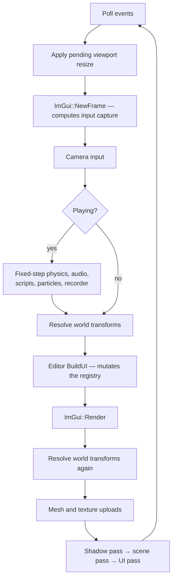

<div align="center">


**A Vulkan 1.2 game engine and editor, written from scratch in C++20.**

Data-oriented ECS core · physically based renderer · dockable editor · hot-reloadable C++ gameplay

[](#requirements)
[](#renderer)
[](#build)
[](#testing)
[](#code-standards)
[](LICENSE)

</div>

---

## What this is

Supersonic is a complete engine, not a renderer with a UI bolted on. Game state
lives in flat [EnTT](https://github.com/skypjack/entt) components; logic lives in
stateless systems over those components; every byte of GPU memory is allocated
through VMA. The editor is part of the engine rather than a separate application:
it edits the same registry the renderer draws and the physics steps.

It is a solo project, built to be read as much as to be run. Where the
implementation departs from the design, the departure is written down in
[ARCHITECTURE.md](ARCHITECTURE.md) instead of being left as an aspiration the
code quietly contradicts.

<div align="center">

<br>
<sub>The editor running the sample scene — shadow-mapped PBR, normal-mapped surfaces, skeletal animation, glTF and procedural geometry, live frame statistics.</sub>
</div>

---

## Features

### Renderer

| | |
|---|---|
| **Physically based shading** | Cook–Torrance GGX with metallic / roughness / ambient-occlusion inputs, per-material — as constants, as a packed ORM map in glTF's channel order, or both, since the map multiplies the constants |
| **Lighting** | Clustered forward: the view frustum is cut into 16x9x24 froxels and each fragment loops only the lights that reach it, so the count is bounded by what overlaps one small box rather than by the shader. Directional, point and spot, with distance attenuation and a smooth cone falloff; directionals are never clustered because they reach everywhere |
| **Cascaded shadows** | Four 2048² D32 cascades in one array image, fitted to the camera by bounding sphere and snapped to the texel grid so edges do not crawl; per-cascade normal offset, 3×3 PCF, and a cross-fade across each split |
| **Normal mapping** | Tangent-space, with glTF-convention `vec4` tangents (handedness in `w`) generated for procedural meshes too |
| **Frustum culling** | Gribb–Hartmann plane extraction; the scene pass culls against the camera, the shadow pass against the light, so nothing off-screen pops its shadow in and out |
| **HDR + bloom** | Floating-point scene target, luminance-thresholded bright pass with a soft knee, separable half-res blur, then tone map and sRGB encode — exactly one encode, at the end of the chain |
| **Transparency** | A blended pass after the opaque one and after the sky, sorted back to front, with depth writes off — per-material, and particles ride the same pipeline |
| **Alpha cutout** | A per-material alpha threshold discarded before shading, so foliage and grates keep a hard edge and stay opaque instead of sorting against themselves in the blend pass — and it reaches the shadow too: a leaf casts its holes, on a second depth pipeline that culls neither face, while a blended surface casts nothing rather than a rectangle |
| **Sky and fog** | A procedural gradient sky drawn as a fullscreen triangle where nothing else claimed the depth, and exponential-squared distance fog, both authored per scene |
| **Emissive** | A per-material emissive colour and strength, driven above 1.0 to trip the bloom threshold |
| **Texture sampling** | A generated mip chain and anisotropic filtering, both guarded on the device actually supporting them |
| **Anti-aliasing** | 4× MSAA, resolved into the image the editor samples |
| **Pipeline cache** | The driver's compiled pipelines persist to disk between runs, validated against vendor, device and driver UUID before reuse |
| **Grid** | Procedural infinite ground grid, depth-tested and analytically anti-aliased |

### Assets

- **glTF 2.0** import via tinygltf — meshes, materials, texture references, **skins and animations**
- **Wavefront OBJ** import
- **Textures** through `stb_image`, with per-material descriptor sets cached by texture pair
- **Procedural geometry** — cube, sphere, plane, and a heightfield **terrain generator**
- **Shared materials** as `.material` assets — one asset, many entities, edited once; create and assign them from the content browser, or detach an entity with *Make Unique*
- **Scenes and prefabs** as readable JSON (`.scene`, `.prefab`), parsed by a hand-written reader with no external dependency

### Simulation

- **Input** — named actions and axes over keyboard, mouse and gamepad; any bound source satisfies an action, so a pad and a keyboard drive the same game without either knowing about the other. The pointer can be **locked** for mouse-look: the editor takes it back between plays and losing the window always releases it, so a captured cursor cannot trap you
- **Fixed-step physics** with an accumulator capped so a hitch costs fidelity rather than exploding the solver
- **World queries** — raycast, sphere overlap and a ground check against *colliders* rather than render bounds, available to C++ and to hot-reloaded scripts
- **Collision** — sort-and-sweep broadphase; a narrowphase of four shapes and four pair tests, because a sphere is a capsule whose segment has no length: nearest points between segments for the round pairs, segment-against-box for a capsule or sphere against a crate, the separating axis theorem over fifteen axes with Sutherland–Hodgman clipping for box against box, and a heightfield for terrain — which is a function rather than a triangle soup, so the cells a shape can touch are an index range and the seams need no internal-edge filtering. Mass-weighted impulse response with Coulomb friction, slop-limited positional correction so stacks settle instead of vibrating, speculative contacts so a fast body lands on a wall rather than through it, immovable collider-only obstacles, and non-resolving trigger volumes
- **Joints** — point, distance and hinge constraints between two bodies or between a body and a fixed point in the world, solved in the same iteration as the contacts so a body held by a rope *and* resting on the floor satisfies both at once. A rope resists stretching only, so a chain can fold; the position pass sweeps four times re-reading as it goes, which is what makes a five-link rope hang at its length rather than half a per cent longer
- **3D audio** on XAudio2 with a from-scratch WAV decoder, inverse-distance attenuation and listener-relative panning
- **In-game UI** — text, panels, buttons and a text field, anchored so a HUD authored at one resolution survives every other; a script reads what was typed and hears it submitted
- **Particle systems** with per-emitter pools, so two emitters cannot starve each other
- **Job system** — a worker pool with a counter fence, used where the work is genuinely independent: terrain generation, per-vertex tangent bases and particle integration. Command recording, the transform hierarchy, scripts and collision response stay on the main thread on purpose, and the code says why
- **Skeletal animation** — glTF skins and animation channels with LINEAR, STEP and CUBICSPLINE interpolation; joints are reordered parent-before-child at load so a pose is one forward pass, the joint palette lives in a storage buffer indexed per draw, the shadow pass skins from the same palette, and the render bounds follow the pose so an animated character is not culled against its bind box
- **Scripting** — built-in components plus a **hot-reloadable C++ plugin**: rebuild the script target while the engine runs and the new code is swapped in without a restart

### Editor

| | |
|---|---|
| **Dockable layout** | ImGui docking with saved layout presets |
| **Hierarchy** | Full transform parenting via drag-and-drop, with cached world matrices |
| **Inspector** | Every component editable, with a dynamic *Add Component* menu |
| **Gizmos** | ImGuizmo translate / rotate / scale, `W` `E` `R` |
| **Selection** | Viewport raycast picking against real mesh bounds, not an assumed unit cube |
| **Play / Pause / Stop / Step** | Snapshots the scene on Play and restores it on Stop, so a scene can be authored, tried, and got back |
| **Undo / redo** | 64 steps over the scene serializer — `Ctrl+Z`, `Ctrl+Y` |
| **Animator** | Clip, speed, loop and a scrubbable time slider — poses evaluate every frame, so scrubbing shows the result immediately |
| **Time-travel rewind** | Scrub backwards through recorded simulation frames |
| **Fly camera** | The viewport has its own camera, so framing a shot in the editor does not move the game's |
| **Statistics** | Per-frame CPU zone timings, a frame-time graph plotted from the raw delta so a hitch is actually visible, entity count, draw/cull counts per pass, contact count, worker threads, script-host state |
| **Console** | Levelled, categorised engine log with substring filtering, mirrored to a file beside the binary |
| **Interface** | Inter and Font Awesome embedded in the binary, an accent palette from the engine's own branding, image thumbnails in the browser, a floating viewport HUD, and DPI scaling from the monitor |
| **Packaging** | One-click standalone build of the current scene |

### Platforms

Developed and tested on **Windows** with MSVC. The build system carries target
configurations for **Linux**, **macOS** and **iOS** (MoltenVK) and **Android**
(NDK / NativeActivity); those targets configure and compile but are not yet
soak-tested, and are honestly labelled as such rather than claimed as shipping
support.

---

## Getting started

### Requirements

| | |
|---|---|
| **Compiler** | C++20 — MSVC 2022, GCC 11+, or Clang 13+ |
| **CMake** | 3.20 or newer |
| **GPU** | Any Vulkan 1.2 capable driver |
| **Vulkan SDK** | Strongly recommended — see below |

Every third-party dependency is vendored under `third_party/`. There is no
package manager step and nothing to fetch: GLFW, GLM, EnTT, ImGui, ImGuizmo,
stb, tinygltf, VMA and the Vulkan headers are all in the tree.

> **On Linux, that is not quite the whole story.** GLFW needs X11 development
> headers to configure at all, and GLFW 3.4 defaults to building a Wayland
> backend and hard-fails with `Failed to find wayland-scanner` unless the full
> Wayland toolchain is present. ALSA's headers are what decide whether the
> engine gets real audio or compiles its documented no-op. What CI installs:
>
> ```bash
> sudo apt-get install -y libvulkan-dev libx11-dev libxrandr-dev >   libxinerama-dev libxcursor-dev libxi-dev libxkbcommon-dev >   pkg-config libasound2-dev
> cmake -S . -B build -DGLFW_BUILD_WAYLAND=OFF
> ```

> **On the SDK.** The engine builds and runs without it, falling back to the
> vendored headers and the loader that ships with your driver. But without
> `VK_LAYER_KHRONOS_validation`, invalid Vulkan usage does not produce an error
> message — it produces an access violation, or nothing at all until the code
> runs on someone else's hardware. The SDK also supplies `glslc`; without it
> CMake cannot rebuild the shaders and falls back to the committed SPIR-V, so
> GLSL edits are silently ignored. CMake warns when that happens.

### Build

```bash
# Single-config generators (Ninja, Makefiles) — build type is chosen here
cmake -B build -DCMAKE_BUILD_TYPE=Release
cmake --build build --parallel
```

```powershell
# Visual Studio is multi-config: it ignores CMAKE_BUILD_TYPE, so pass --config
cmake -B build -G "Visual Studio 17 2022" -A x64
cmake --build build --config Release --parallel
```

### Run

Asset paths resolve relative to the working directory, so **launch from the
project root**:

```bash
./build/SupersonicEngine                    # Linux / macOS
.\build\Release\SupersonicEngine.exe        # Windows
```

Visual Studio's debugger working directory is already set to the project root,
so <kbd>F5</kbd> works with no further setup.

Full command reference, including validation-layer setup, shader compilation and
the script hot-reload loop: **[AGENTS.md](AGENTS.md)**.

---

## How a frame runs

The frame order in `SupersonicApp::Run` is deliberate, and two of the steps are
load-bearing in ways that are not obvious.



- **The viewport target may only be recreated at the top of the frame.**
  Recreating it frees its framebuffer, images and ImGui descriptor set. Doing
  that after `ImGui::Image` has recorded the texture ID into the frame's draw
  data leaves a draw call pointing at a released descriptor — and
  `vkDeviceWaitIdle` does not save you, because the offending command buffer has
  not been submitted yet.
- **World transforms are resolved twice.** Once before the editor, so the gizmo
  and picking act on current matrices; once after, so rendering reflects the edit
  the user just made rather than lagging a frame behind it.

---

## Repository layout

```
src/
  core/        ECS components, systems, serialization, asset loading, scripting
  renderer/    Vulkan device, swapchain, pipelines, shadows, culling, registries
  editor/      Panels, gizmos, editor camera, undo history
  platform/    Window and OS integration
assets/
  shaders/     GLSL sources and committed SPIR-V
  branding/    Logo and mark
  models/  textures/  audio/  scenes/
plugins/       Hot-reloadable C++ gameplay scripts
platform/      Android and Apple target scaffolding
tests/         Pure-logic regression suites
docs/          Screenshots, and the planning records under docs/planning/
.github/       CI: manual-dispatch only (Actions -> CI -> Run workflow)
```

Roughly 19,200 lines of engine source across 73 translation units, or 26,700
lines counting headers — excluding vendored dependencies and the two
translation units that exist only to compile VMA and tinygltf.

---

## Testing

```bash
ctest --test-dir build -C Release --output-on-failure
```

Thirty-six suites, each a plain executable with no test framework behind it —
pulling one in for pure-logic checks would cost more than it returns.

| Suite | Covers |
|---|---|
| `test_transform` | Matrix and projection conventions |
| `test_hierarchy` | Parenting, world-transform caching, play/stop snapshots |
| `test_frustum` | Plane extraction, AABB transforms, the zero-to-one near-plane convention |
| `test_cascades` | Split distribution, slice fitting, texel snapping, depth range |
| `test_skeletal` | glTF skin import, joint reordering, all three interpolation modes, palette packing |
| `test_raycast` | Viewport picking, slab intersection, depth ordering |
| `test_meshgen` | Primitive generation, winding, tangents, OBJ parsing |
| `test_gltf` | glTF import against real assets in the tree, including a `.glb` with embedded textures |
| `test_serialize` | JSON reader, scene and prefab round-trips |
| `test_undo` | Undo/redo stacks, redo invalidation, snapshot round-trip stability |
| `test_materials` | Material asset round-trip, shared edits, Make Unique, link persistence |
| `test_input` | Action mapping, press/release edges, stick deadzone, gamepad fallback |
| `test_jobs` | Dispatch coverage, the Wait fence, throwing jobs, pool restart |
| `test_physics` | Integration, broadphase, narrowphase, mass-weighted response, triggers, raycast and overlap queries |
| `test_heightfield` | Terrain collision: the grid against the mesh vertex for vertex, seams, ridge crests, grooves, buried recovery, and the cell march a ray does |
| `test_joints` | Constraint arithmetic: momentum conservation, the rod/rope difference, off-centre anchors, the hinge axis, limits, motors, welds, and every degenerate case |
| `test_convexhull` | Hull building and collision: Euler's formula, convexity, a cube's six faces, the vertex cap, and agreement with the box path |
| `test_environmentmap` | IBL on the CPU: the cube face mapping, a constant sky irradiating to itself, both prefilter endpoints, and the Radiance decoder |
| `test_assetdatabase` | Asset identity: minting, sidecars, rename-by-content adoption, and which route a reference resolved by |
| `test_audio` | WAV decoding, including the shipped clip |
| `test_scripts` | Script registry and dispatch |
| `test_blending` | Cross-fade between clips, blend weights, clip switching |
| `test_spotlight` | Cone angles, the straight-down lookAt collapse, shadow frustum fit |
| `test_pointshadow` | Cube-face view matrices, slot assignment, per-light indices |
| `test_uicanvas` | Canvas layout, anchoring, rect resolution |
| `test_uiinput` | UI hit testing, press and release routing |
| `test_mixer` | Bus gain, listener-relative panning, distance attenuation |
| `test_gameruntime` | Manifest parsing, packaged-game detection, executable-relative paths |
| `test_launchoptions` | Argument parsing, missing values, malformed counts |
| `test_json` | Depth limit, trailing content, duplicate keys, malformed input |
| `test_scenemanager` | Deferred loads, Save As, failed-save and failed-load behaviour |
| `test_assetwatcher` | Change detection, deleted and restored files, duplicate watches |
| `test_contacts` | Enter/stay/exit diffing, pair ordering, normal direction, triggers |
| `test_sat` | Oriented box collision, face manifolds, the ramp an AABB could not represent |
| `test_lightselection` | Which lights survive the eight-light cap, and that the sun is not one of the casualties |
| `test_shadowcache` | The signature that lets a depth pass be skipped, and what must dirty it |
| `test_resourcesync` | The signature that lets an entity's mesh and texture resolve be skipped |
| `test_determinism` | That one binary over one scene produces the same frames twice |
| `test_layerstack` | The seam a game lives in: attach, detach, fixed and per-frame callbacks |
| `test_codecextension` | Serialising a game's own components alongside the engine's |
| `test_packaging` | That a packaged folder has a binary, a manifest, and the scene it was asked for |

Every suite is a regression test for a bug that actually happened. The header
comment on each one says which.

### Code standards

- MSVC `/W4` and GCC/Clang `-Wall -Wextra -Wpedantic`, **zero warnings**
- Vendored sources are excluded from the warning level, never the project's own
- Validation layers and synchronization validation clean before any commit that
  touches the renderer

---

## Image-based lighting

The environment used to be two colours mixed by height, so a metal surface
reflected a gradient and a sky brighter than white could not exist. A Radiance
`.hdr` is now convolved into two cubemaps — the diffuse irradiance a surface
facing each direction receives, and a specular chain indexed by roughness — and
the shader samples both.

**This was deferred three times**, on the grounds that its natural check is
"does it look plausible", which this project rejects as evidence. That turned
out to be the wrong question. IBL is four pieces and three of them have exact
oracles:

| piece | how it fails | the oracle |
|---|---|---|
| the cube face mapping | a reflection that comes from the wrong direction, invisibly | a direction turned into a face and back is the direction it was |
| the irradiance integral | a botched solid angle, or a normalisation off by π | the cosine integral over a hemisphere, over π, is **one** — so a constant sky irradiates to that constant |
| the prefiltered chain | energy spread where it should not be | roughness 0 is the environment itself; every roughness of a constant sky is that constant |
| the shader combining them | no CPU oracle exists | see below |

The fourth is checked **differentially**, against code already trusted rather
than against a number somebody wrote down: with the scene's sky and ground
ambient set to one colour, and an environment map of that same colour, the two
paths must produce the same image. They produce the *same bytes* — 0 of 293,695
pixels differ. That single result exercises the `.hdr` decode, the
equirectangular projection, both convolutions, the half-float conversion, the
cube upload, the descriptor bindings and the shader, end to end.

And the other direction: a real HDRI with a sun sixty times white changes
184,884 of 248,395 scene pixels while leaving the procedural sky — which IBL
does not touch — identical in all 45,300 of its own. The zero there is the
control that says the two runs are otherwise the same run.

Three things are load-bearing:

- **A scene that names no environment renders byte-for-byte as it did before
  any of this existed.** The shader branches to the original expression, and
  the check is the same one: a render of MainScene after this landed is
  identical to one from before it. That is what made the change safe to land
  without re-checking every scene in the project.
- **Both cube samplers are always bound.** Reading a descriptor nobody wrote is
  undefined even inside a branch the shader never takes, so a scene with no
  environment binds a one-texel black cube and a flag in the scene block says to
  ignore it.
- **Loading rewrites the two bindings rather than reallocating the sets.** The
  descriptor pool holds exactly one set per frame in flight, so allocating a
  second round exhausts it — the first scene that named an HDRI died on
  `ErrorOutOfPoolMemory` before it drew anything.

The format is Radiance `.hdr`, both encodings. Six PNG faces would have avoided
the parser and cannot hold a value above one, which is most of the point: a sun
is thousands, and clamping it throws away exactly the range that makes a
reflection look like light. Storage is `R16G16B16A16_SFLOAT`, the only HDR
format whose linear filtering every Vulkan implementation must support — and an
over-range value is clamped to the largest finite half rather than to infinity,
because an infinity in a colour becomes a NaN the first time the ambient
occlusion term multiplies it by zero.

**Open:** the procedural sky is still analytic, so a loaded environment is not
what you see when you look up; and there is one environment per scene, which is
what reflection probes exist to fix.

## Asset identity

Every asset reference used to be a raw relative path, so renaming a file in
Explorer broke every scene, prefab and material pointing at it. **Silently** is
the whole problem: the texture is gone, the fallback checkerboard appears, and
nothing says which of forty references used to work.

Each asset gets a `.meta` sidecar beside it — `floor_tiles.png.meta` — holding a
32-character identity and a content hash. That is the one place it can live and
still be copied by a packager that copies directory trees, moved by a person who
moves the asset, and diffed by git.

A saved reference carries **both** the identity and the path:

```json
"AlbedoTexture": "assets/textures/floor_tiles.png",
"AlbedoTextureGuid": "320e51673e6f8a91c3d06bca0efebea9",
```

Both, not either. The identity is what survives a rename; the path is what makes
the file readable and mergeable, and it is the migration story — every scene
written before identities existed has a path and no identity, and goes on
working unchanged.

**Renaming is recovered by content.** Explorer has never heard of a `.meta`, so
a rename leaves the sidecar behind under the old name and the asset arrives with
no identity at all. `--import-assets` matches orphaned sidecars against
un-identified files by their contents and carries the identity across. The
ordering is the feature: mint first and every renamed file gets a brand new
identity, adoption finds nothing left to adopt, and the headline case silently
does nothing while every counter still reads like success.

**Scanning creates nothing.** A scan runs from load paths and from tests, and
one that minted as a side effect would have the test suite writing sidecars into
your assets folder the first time you ran it. `Scan` reads; `--import-assets`
writes.

**A fallback is counted, not hidden.** When a reference carries an identity
nothing answers to, the saved path is used *and* the database counts it and logs
a warning — because a fallback that looks like success is worse than no feature:
it is the old broken behaviour wearing the new one's clothes. Every test asserts
which route a reference resolved by, since one that only checks the answer also
passes when the fallback happened to be right.

```
SupersonicEngine --import-assets
```

mints identities, then re-writes the `.material` and `.scene` files that
reference them so they carry the identities too. A scene is written to a string,
read back, and written again; it is only committed when the two strings are
identical — a fixed point, which is a far stronger statement than "the same
number of entities came back".

**Not done, and separable:** a rename made while the editor is running is only
picked up at the next import — nothing re-points a live scene. Prefabs
deliberately keep only the shape of a reference and not its target, because a
prefab cannot name an entity in a scene it is not part of.


## Roadmap

Split into what is done and what is next, because a list on which every box is
ticked has stopped being a roadmap. The README is already comfortable calling
Android "not functional"; extending that register forward costs nothing.

## Shipped

- [x] PBR, normal mapping, cascaded shadow maps, point and spot shadows
- [x] HDR pipeline with bloom, 4× MSAA, a procedural sky and distance fog
- [x] A sorted transparent pass, and emissive materials that drive the bloom
- [x] Shadows that know what a material is: a cut-out surface casts its own
      silhouette rather than its bounding rectangle, and a blended one casts
      nothing at all
- [x] Transform hierarchy, prefabs, scene and material serialization
- [x] Play/Stop, undo/redo, time-travel rewind
- [x] Frustum culling, persistent pipeline cache
- [x] Oriented-box collision by SAT, speculative contacts, a batched solver and
      sleeping — with world queries against colliders rather than render bounds
- [x] Job system, applied where the work is provably independent
- [x] Skeletal animation with cross-fade blending
- [x] In-game UI canvas, audio mixer, one-click packaging
- [x] Headless `--frames` runs, a validation gate that fails the build, a CPU
      profiler and a levelled log with an editor console
- [x] A layer seam a game lives in, a simulation clock that reproduces, and a
      serializer a game can extend with its own components
- [x] Assign a mesh, a texture or an audio clip by dragging it from the content
      browser; meshes, textures and prefabs reload when the file changes
- [x] glTF materials — base colour, metallic, roughness, the base-colour AND
      normal maps, emissive with `KHR_materials_emissive_strength`, and
      `alphaMode` — imported onto the entity when a model is assigned
- [x] `.glb` support: a single-file export used to fail to load outright, over
      a texture. Embedded images are extracted to `cache/` verbatim, so every
      texture in the engine stays a path
- [x] More than one scene, switchable at runtime by a layer or a script
- [x] Mouse capture: a script can lock the pointer, the camera looks without a
      button held, and losing the window always gives it back
- [x] Text input: a HUD text field a game can author, type into and read back,
      with the keyboard taken from the game while it has focus
- [x] Image-based lighting: a Radiance `.hdr` convolved into diffuse
      irradiance and a roughness-indexed specular chain, so metal reflects the
      room rather than a two-colour gradient
- [x] Convex hull colliders, built from the mesh you can see, with a
      non-uniform scale that is exact rather than approximated
- [x] Hinge limits, motors, breaking forces and welds — a door that stops at
      ninety degrees, a powered wheel, a rope that snaps under load, and two
      dynamic bodies rigidly fixed together
- [x] Asset identity: a `.meta` beside each asset, an identity written next to
      every saved reference, and a rename recovered by matching contents, so
      renaming a texture in Explorer no longer breaks the scenes that name it
- [x] Roughness, metallic and ambient occlusion as a packed map, in the channels
      glTF packs them into, multiplying the per-material constants rather than
      replacing them
- [x] Clustered forward lighting: the eight-light cap is gone. The frustum is cut
      into 16x9x24 froxels and a fragment loops only the lights that reach it

### Next

Ordered by what it costs against what it unblocks, not by how interesting it is.

- [ ] **The rest of the asset pipeline.** Identity is done — a reference
      survives a rename — but animation clips, audio and `.material` files are
      still outside hot reload, so editing one means restarting; a clip is typed
      into a text box rather than picked; and a rename made while the editor is
      RUNNING is only noticed at the next import, because nothing re-points the
      live scene
- [ ] **A sky that matches the environment, and probes.** An HDRI now lights
      the scene, but the procedural sky behind it is still analytic — so a
      loaded environment is not what you see when you look up. And there is one
      environment for the whole scene: a room and the outdoors it opens onto
      light identically, which is what reflection probes exist to fix
- [ ] **Concave collision.** A hull is convex, so a doughnut collides as a
      disc and a chair as the block it sits in. Closing it means decomposing a
      shape into several hulls automatically, which is a different piece of work
      with a different failure mode. A hull against TERRAIN also collides as its
      bounding box, so a wedge on a hill floats by the gap between the two
- [ ] **Joint sequencing and soft constraints.** Limits, motors, breaking and
      welds all work, but a joint still has no spring or damper - everything is
      rigid or nothing - and there is no way to say that one joint should be
      solved before another, which a long articulated chain wants

Deliberately not on this list, with the reasons written down in
[ARCHITECTURE.md](ARCHITECTURE.md): swept CCD, a persistent broadphase, warm
starting, a multi-threaded solver, and instancing — the last measured at 0.44 ms
of a 1.7 ms shipped frame and rejected on that basis rather than on taste.

---

## Acknowledgements

Built on the work of others, all vendored in `third_party/`:
[GLFW](https://www.glfw.org/) ·
[GLM](https://github.com/g-truc/glm) ·
[EnTT](https://github.com/skypjack/entt) ·
[Dear ImGui](https://github.com/ocornut/imgui) ·
[ImGuizmo](https://github.com/CedricGuillemet/ImGuizmo) ·
[stb](https://github.com/nothings/stb) ·
[tinygltf](https://github.com/syoyo/tinygltf) ·
[Vulkan Memory Allocator](https://github.com/GPUOpen-LibrariesAndSDKs/VulkanMemoryAllocator) ·
[Vulkan-Headers](https://github.com/KhronosGroup/Vulkan-Headers)

## License

[MIT](LICENSE). Use it, change it, ship it, sell it — commercially or otherwise,
with or without credit. The only condition is that the copyright notice travels
with copies of the engine's own source.

It comes with **no warranty of any kind, and no liability**. If you build
something with it and that something breaks, that is yours to own, not the
author's.

Every vendored dependency under `third_party/` is permissive too — MIT, zlib or
Apache-2.0 — and none of them puts a condition on what you may build.
Attributions and full licence texts are in
[THIRD_PARTY_LICENSES.md](THIRD_PARTY_LICENSES.md).

Contributions are welcome under the same licence; see
[CONTRIBUTING.md](CONTRIBUTING.md).

<div align="center">
<br>

</div>
